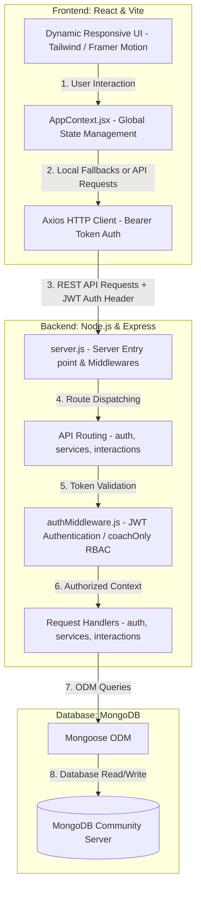
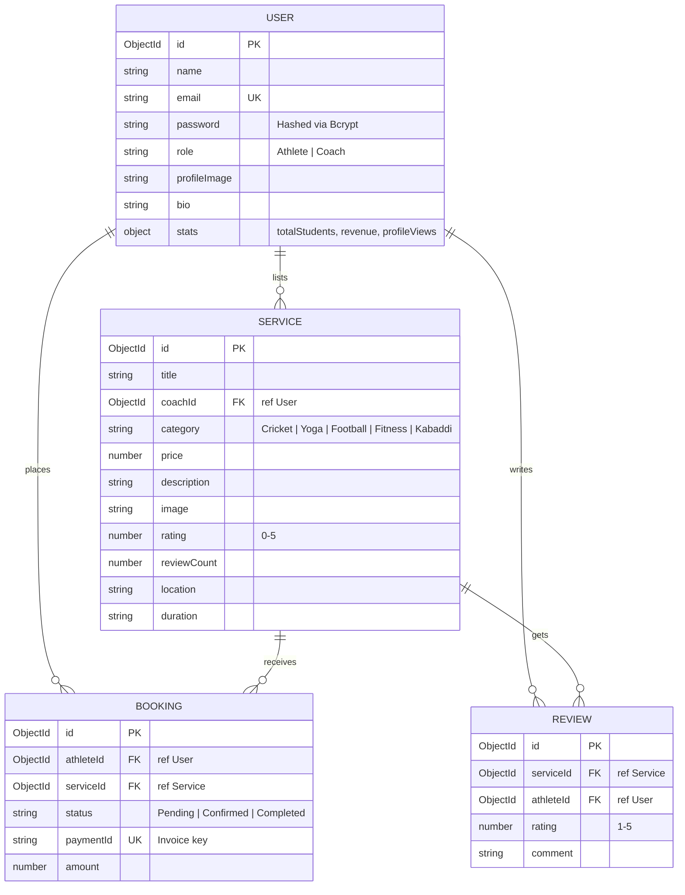

# FitQuest India: FSD Faculty Presentation & Viva Guide

This guide is structured to help you present **FitQuest India** to your Full Stack Development (FSD) faculty and answer external viva examiners with absolute confidence. It breaks down the system architecture, database design, core codebase files, and security mechanisms, and provides ready-to-answer viva questions.

---

## 🗺️ 1. High-Level Project Philosophy
**FitQuest India** is a dual-sided sports and fitness marketplace built on the modern **MERN Stack** (MongoDB, Express, React, Node.js). 

### The Problem It Solves
- Fragmented fitness ecosystem where finding certified personal coaches, specialized sports academies, or local gym schedules requires looking through multiple disconnected platforms.
- Lack of transparency in qualifications and credentials for coaches.

### The FitQuest Solution
- **Unified Discovery Platform**: Centralizes services across 5 distinct categories: **Cricket, Football, Yoga, Fitness, and Kabaddi** across major Indian hubs (Bengaluru, Mumbai, Delhi, etc.).
- **Dual-Role Dashboard**: Seamlessly transitions between two user personas:
  1. **Athlete (User)**: Browse, filter by price/rating/location, read reviews, and book services instantly with mock payment tracking.
  2. **Coach (Seller)**: List and manage programs, track client metrics, view active statistics (Total Students, Monthly Revenue, Profile Views), and upload professional credentials.

---

## 🏗️ 2. Architectural System Design



### Flow of a Request (e.g., Booking a Service)
1. **Trigger**: An Athlete logs in, visits a service page, and clicks "Book Session".
2. **Context Dispatch**: The frontend triggers `bookService(service)` inside `AppContext.jsx`.
3. **HTTP Client**: Axios sends a `POST` request to `http://localhost:5000/api/interactions/book` carrying `{ serviceId }`. The request includes the **JWT token** in the `Authorization` header: `Bearer <jwt_token>`.
4. **Middleware Interception**: The Express server routes the request through the `protect` middleware, which parses the header, decrypts the token using `JWT_SECRET`, checks expiration, and appends the decoded user profile data to the `req.user` object.
5. **Controller Action**: The `createBooking` handler in `interactionController.js` is executed. It queries the `Service` model, calculates the transaction amount, and creates a secure `Booking` record in MongoDB.
6. **Response**: The backend returns the populated booking details, and the frontend updates React state dynamically to show the confirmation banner.

---

## 🗄️ 3. Database Schema Design (MongoDB & Mongoose)

FitQuest India models relations using MongoDB references (`mongoose.Schema.Types.ObjectId` with `ref`). This achieves relational normalization on a NoSQL database while keeping queries fast.



### Schema Details

#### 1. User Schema (`server/models/User.js`)
Stores details for both Athletes and Coaches. Coaches have an extra `stats` nested object.
- **`email`**: Marked `unique: true` to prevent duplicate account creation.
- **`role`**: Validated by `enum: ['Athlete', 'Coach']` to ensure role strictness.
- **`timestamps`**: Automatically injects `createdAt` and `updatedAt`.

#### 2. Service Schema (`server/models/Service.js`)
Holds the coaching listings.
- **`coachId`**: References the `User` collection.
- **`category`**: Checked by `enum: ['Cricket', 'Yoga', 'Football', 'Fitness', 'Kabaddi']`.
- **`rating` & `reviewCount`**: Denormalized attributes to display aggregate scores efficiently without doing expensive collection scans on every load.

#### 3. Booking Schema (`server/models/Booking.js`)
Tracks session purchases.
- **`athleteId`**: Points to the `User` who booked.
- **`serviceId`**: Points to the `Service` being purchased.
- **`paymentId`**: Unique reference string mimicking a Razorpay/Stripe invoice reference.

#### 4. Review Schema (`server/models/Review.js`)
Saves individual student feedback.
- Double-reference pointing to the `Service` and the `User` (Athlete) writing the review.

---

## 🔒 4. Security & Authentication Architecture

FitQuest India implements industry-standard **Stateless JWT-Based Authentication** to protect routes.

```text
[ Athlete / Coach ]                                         [ Express App Server ]
        |                                                              |
        |---- 1. POST /api/auth/login (Credentials) ------------------>|
        |                                                              |-- 2. Verify Email
        |                                                              |-- 3. Bcrypt Compare Password
        |                                                              |-- 4. Generate JWT Sign
        |<--- 5. JSON Response { token, userPublicInfo } --------------|
        |
    (Store token in LocalStorage)
        |
        |---- 6. GET /api/interactions/mybookings -------------------->|
        |        Header: Authorization: Bearer <token>                 |-- 7. Validate with JWT_SECRET
        |                                                              |-- 8. Extract req.user info
        |<--- 9. Authenticated Data Response --------------------------|
```

### Password Protection (Bcrypt)
Passwords are never saved in plain text.
- During sign-up, `bcrypt.hash(password, 10)` generates a hash with a salt factor of `10`.
- During login, `bcrypt.compare(password, user.password)` cryptographically matches the attempt without reversing the hash.

### Token Architecture
- A JWT is generated on the server using `jwt.sign({ id: user._id, role: user.role }, process.env.JWT_SECRET)`.
- It has a signature containing the payload, protecting it against client-side tampering.
- Expires in `7 days`, balancing user convenience and security.

---

## 🛠️ 5. Key File Walkthrough

### 🔒 `server/middleware/authMiddleware.js`
This file acts as our security gatekeeper.
- **`protect`**: Intercepts the request, validates the JWT, and extracts the user context.
- **`coachOnly`**: Role-Based Access Control (RBAC). It checks if the user's role in the decrypted token is `Coach`. If not, it halts the request with a `403 Forbidden` response.

```javascript
import jwt from 'jsonwebtoken';

// Authenticates the request and decodes the JWT
export const protect = async (req, res, next) => {
  let token;
  if (req.headers.authorization && req.headers.authorization.startsWith('Bearer')) {
    try {
      token = req.headers.authorization.split(' ')[1];
      const decoded = jwt.verify(token, process.env.JWT_SECRET || 'fitquest-dev-secret');
      req.user = decoded; // Injects { id, role } into the request object
      next();
    } catch (error) {
      res.status(401).json({ message: 'Not authorized, token failed' });
    }
  }
  if (!token) {
    res.status(401).json({ message: 'Not authorized, no token' });
  }
};

// Protects coach-specific routes (RBAC)
export const coachOnly = (req, res, next) => {
  if (req.user && req.user.role === 'Coach') {
    next();
  } else {
    res.status(403).json({ message: 'Not authorized as a Coach' });
  }
};
```

---

### 🌐 `client/src/contexts/AppContext.jsx`
The central hub for state management in our React app. It uses **React Context API** instead of heavy Redux.
- **Dynamic API Resiliency**: It has built-in mock fallbacks. If the backend is turned off, the frontend doesn't crash! It automatically falls back to clean, mock-data objects (`sampleServices`, `fakeUsers`), keeping the site completely interactive and functional.
- **Local Storage Sync**: Automatically syncs user credentials and theme (`dark` / `light`) into the browser's `localStorage` for session persistence.
- **Axios Interceptor**: Automatically attaches the JWT bearer token to every outbound network call.

---

## 💻 6. How to Run Locally

### Prerequisites
Make sure **MongoDB Server** is running on your machine (default port `27017`).

### Step 1: Server Startup
```bash
cd server
npm install
# Ensure .env is populated with MONGO_URI and JWT_SECRET
npm run seed  # Seeds 10 coaches, 1 athlete, and 30 services
npm run dev   # Starts Nodemon watcher at http://localhost:5000
```

### Step 2: Client Startup
```bash
cd client
npm install
npm run dev   # Starts Vite development server at http://localhost:5173
```

---

## 🎓 7. FSD Faculty Viva Q&A (Common Questions & Expert Answers)

Here are the exact questions external examiners love to ask to test your depth of knowledge, accompanied by professional answers.

### ❓ Q1: Why did you use JWT instead of standard Session-based Authentication?
> **Answer**: Session-based authentication is stateful, meaning the server has to store session IDs in memory or a database (e.g., Redis) and look them up on every request. This is hard to scale horizontally across multiple servers. 
> 
> In contrast, **JWT (JSON Web Token)** is **stateless**. The user information is cryptographically signed and stored on the client side. The server only needs to decrypt the token using its secret key. This reduces database queries and makes the backend highly scalable.

### ❓ Q2: What is Bcrypt and why is the second argument "10" in `bcrypt.hash()`?
> **Answer**: **Bcrypt** is a key derivation function designed specifically for hashing passwords. It uses an adaptive hashing algorithm to defend against brute-force attacks. 
> 
> The second argument (`10`) represents the **Salt Rounds**. The number of rounds determines the work factor: $2^{10}$ hashing iterations are performed. Increasing this number makes the hashing exponentially slower and more secure, but also increases server CPU consumption. `10` is the industry standard sweet-spot.

### ❓ Q3: What is the purpose of Mongoose's `.populate()` method? How does it differ from SQL Joins?
> **Answer**: MongoDB is a document database, so it doesn't support traditional SQL joins. However, we can reference documents in other collections using `ObjectId` and `ref`.
> 
> Mongoose's `.populate()` method is a utility that automates this link. Behind the scenes, it executes a separate query to fetch the referenced document (e.g., fetching a Coach's name using the `coachId` reference inside a `Service`). It makes our code much cleaner, though we must design queries carefully to avoid $N+1$ query performance issues.

### ❓ Q4: How did you implement Role-Based Access Control (RBAC) in this project?
> **Answer**: We implemented RBAC using **Custom Express Middleware**. We have a `protect` middleware that verifies the JWT and attaches the decrypted payload (`req.user = decoded`) to the request object. 
> 
> Then, we have a secondary middleware called `coachOnly`. It checks if `req.user.role === 'Coach'`. If true, it calls `next()` to pass execution to the controller; otherwise, it intercepts the request and returns a `403 Forbidden` status code, preventing unauthorized access.

### ❓ Q5: What is CORS? How did you resolve it in this application?
> **Answer**: **CORS (Cross-Origin Resource Sharing)** is a browser security mechanism that prevents web applications running on one domain (like the React client on `http://localhost:5173`) from making requests to a different domain (like the Express API on `http://localhost:5000`) without explicit permission.
> 
> We resolved it by installing the `cors` package in Express and mounting it as application-wide middleware: `app.use(cors())`. This sends the appropriate headers (like `Access-Control-Allow-Origin: *`) in backend responses, telling the browser to permit cross-origin requests.

### ❓ Q6: How does the application maintain state across page refreshes?
> **Answer**: The application uses **React Context** (`AppContext.jsx`) in tandem with **LocalStorage**. In the context's initialization, we pull data from localStorage if it exists (`localStorage.getItem('fq-token')`). 
> 
> We also run a React `useEffect` hook that listens to state updates. Whenever the state of the user or JWT token changes, the hook automatically synchronizes it back to localStorage. This ensures users stay logged in even after refreshing.

---

*Prepared by Mohammed Ishaaq & Kiran Raj for the 6th-semester ISE Full Stack Development (FSD) Course.*
