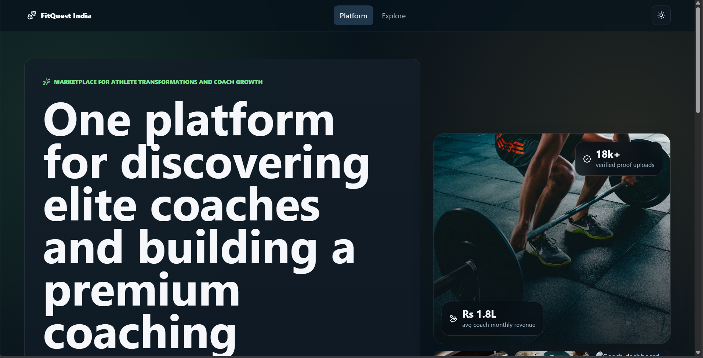
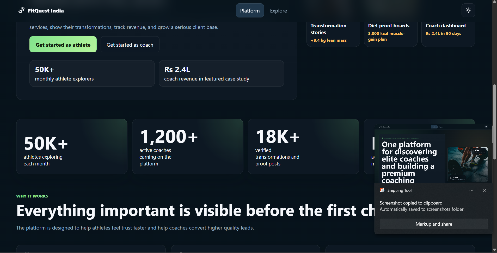
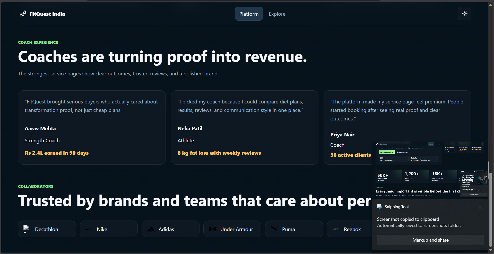
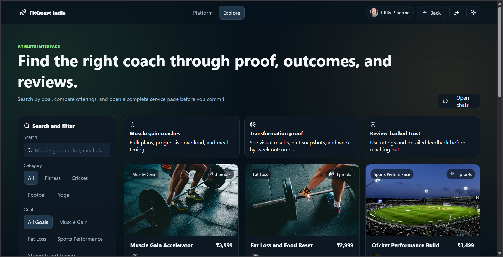
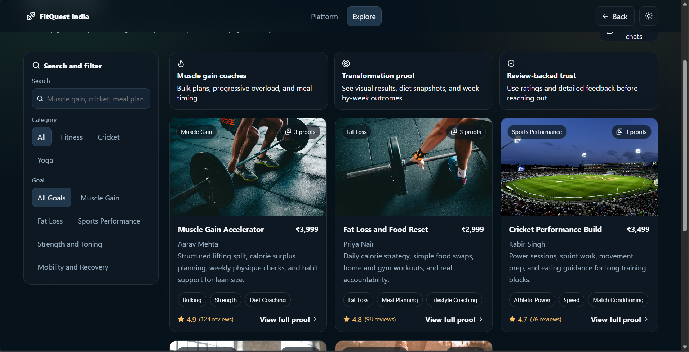
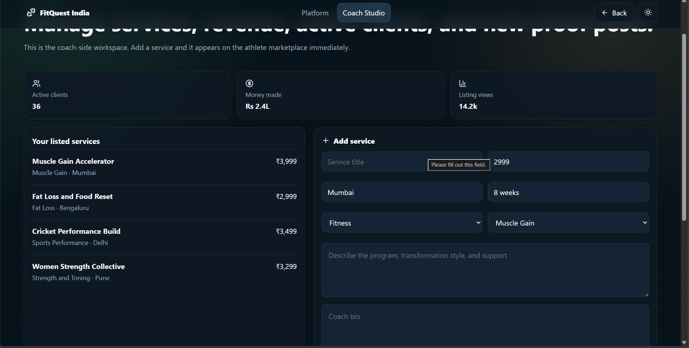

# FitQuest


## The Idea
FitQuest India is a comprehensive fitness marketplace designed to bridge the gap between fitness service providers and enthusiasts. Built as a mini-project for the 6th-semester ISE "Full Stack Development" subject, it demonstrates a complete implementation of the MERN stack to handle real-world service booking workflows.

## Problem Statement
Finding verified local gyms, specialized coaches, or fitness centers often involves fragmented searches across multiple platforms. FitQuest India centralizes this discovery process, providing a unified interface for users to explore services, read reviews, and manage bookings seamlessly.

## Key Features
- **Secure Authentication**: Robust user registration and login system using JWT and Bcrypt.
- **Service Discovery**: Browse various fitness services with detailed descriptions and pricing.
- **Real-time Booking**: Seamlessly book sessions with local coaches or gym facilities.
- **User Reviews**: Integrated feedback system to maintain service quality and transparency.
- **Dynamic UI**: Responsive and fluid interface built with Framer Motion and Lucide icons.

## How it Works
FitQuest operates as a dual-sided marketplace catering to both fitness professionals and enthusiasts:

- **For Coaches**: Trainers and service providers can create profiles and upload their services. They are encouraged to provide **proof of expertise** and certifications to build trust. Coaches can list services across multiple categories including **Sports, Exercise, Dance, and Yoga**.
- **For Users**: Enthusiasts can explore verified services based on categories and location. The platform leverages a **review-based system**, allowing users to make informed decisions and get the most out of their fitness journey.

## Visual Preview
| | |
|:---:|:---:|
|  |  |
| Fig 1.1: Home Page | Fig 1.2: Home Page Features |
|  |  |
| Fig 1.3: Community Section | Fig 1.4: User Discovery |
|  |  |
| Fig 1.5: Service Details | Fig 1.6: Coach Dashboard |

## Repo Structure
```text
FitQuest/
├── client/                # Frontend React application (Vite)
│   ├── src/               # UI components, pages, and logic
│   └── package.json       # Frontend dependencies
├── server/                # Backend Node/Express API
│   ├── controllers/       # Request handlers
│   ├── models/            # MongoDB schemas
│   ├── routes/            # API endpoints
│   ├── middleware/        # Auth and security logic
│   └── seed.js            # Initial database population script
└── LICENSE                # MIT License
```

## How to Clone
```bash
git clone https://github.com/ishaaqdev/FitQuest.git
cd FitQuest
```

## Prerequisites
Before you begin, ensure you have the following installed:
- **Node.js**: [Download and Install](https://nodejs.org/)
- **MongoDB**: [Local](https://www.mongodb.com/try/download/community) or [Atlas](https://www.mongodb.com/cloud/atlas)
- Check **[requirements.txt](requirements.txt)** for the full list of dependencies and versions.

## How to Run

### 1. Server Setup
- Navigate to the server directory: `cd server`
- Install dependencies: `npm install`
- Create a `.env` file and add your `MONGO_URI` and `JWT_SECRET`.
- Seed the database with sample data: `npm run seed`
- Start the server: `npm run dev`

### 2. Client Setup
- Open a new terminal and navigate to the client directory: `cd client`
- Install dependencies: `npm install`
- Start the development server: `npm run dev`

## Contributing
Contributions are welcome! If you'd like to improve the project:
1. Fork the repository.
2. Create a new branch (`git checkout -b feature/improvement`).
3. Make your changes.
4. Submit a pull request.

## Builders
This project was developed by:

- **Mohammed Ishaaq**  
  [GitHub](https://github.com/ishaaqdev) | [LinkedIn](https://www.linkedin.com/in/ishaaq42/)

- **Kiran Raj**  
  [GitHub](https://github.com/Kiranraj18007) | [LinkedIn](https://www.linkedin.com/in/kiranraj-g/)

Developed for the FSD Course (6th Sem ISE).
